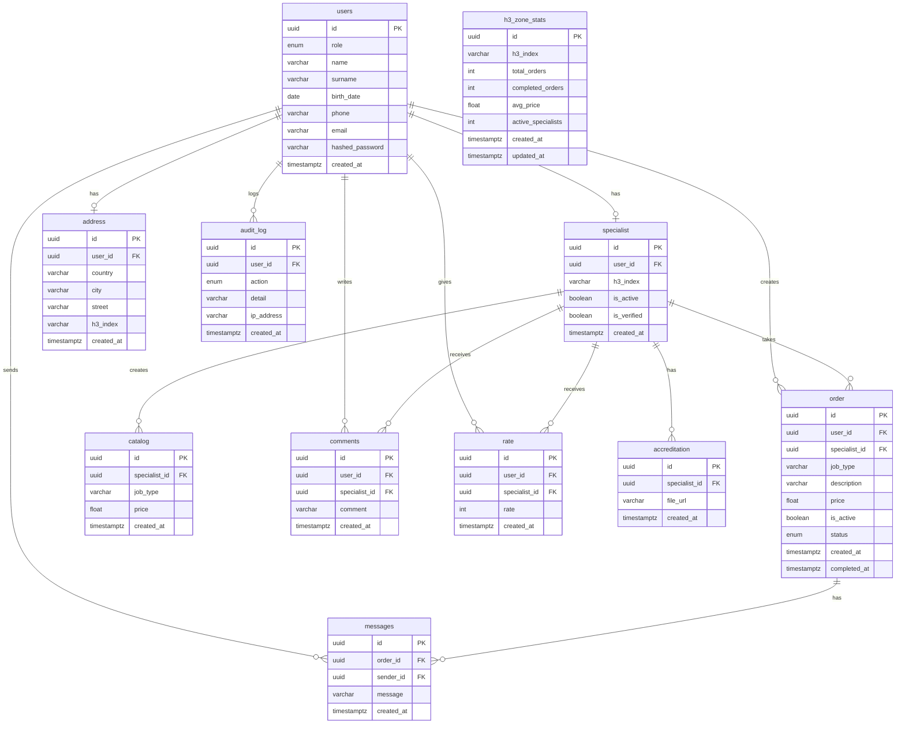

# Gig Platform API

A REST API for a location-aware specialist marketplace built with FastAPI, PostgreSQL, H3 geospatial indexing, event-driven analytics, RBAC, and audit logging.

---

## Quick Start

```bash
# Install dependencies
pip install -r requirements.txt

# Run the server
python -m uvicorn backend.app.main:app --reload
```

Swagger UI: http://127.0.0.1:8000/docs

---
## Team

| Name               | Role |
|--------------------|------|
| Alibek Aglanov     | BE   |
| Danial Kaltay      | PM   |
| Ainat Yermurat     | FE   |
| Sauytbek Beksultan | FE   |
---

## How H3 is Used in the System


### 1️) Specialist Location Storage

When a specialist registers, their coordinates (`lat`, `lon`) are converted into an H3 index and stored in the database.

This enables fast indexed lookups instead of expensive runtime distance calculations.

---

### 2) Geolocation Search (Query + Filter)

**Endpoint**

```
GET /api/v1/specialists/nearby?lat=43.2&lon=76.8&radius=2
```

**Process**

Instead of calculating distance for every row:


The system performs a fast indexed `IN` query on precomputed H3 cells.

At scale (e.g., 1,000,000 specialists), this reduces query time from seconds to milliseconds.

---

### 3️) Zone-Based Analytics (Aggregation)

When an order is created, a background worker updates aggregated statistics per H3 zone.

**Endpoint**

```
GET /api/v1/analytics/h3/nearby-stats?lat=...
```

This enables:

* O(1) zone-level metric lookups
* Real-time demand analysis
* Efficient geographic reporting
* High scalability

---


# Functional Requirements
## User

| #  | As a... | I can...        | Object             |
|----|---------|-----------------|--------------------|
| 1  | User    | **create**      | Profile            |
| 2  | User    | **update**      | Profile            |
| 3  | User    | **create**      | Specialist profile |
| 4  | User    | **search** near | Specialist         |
| 5  | User    | **get**         | Specialist info    |
| 6  | User    | **create**      | Order              |
| 7  | User    | **complete**    | Order              |
| 8  | User    | **rate**        | Specialist         |
| 9  | User    | **comment**     | Specialist         |
| 10 | User    | **write**       | Specialist         |
| 11 | User    | **see**         | Catalog            |

## Admin

| #  | As a... | I can...   | Object     |
|----|---------|------------|------------|
| 12 | Admin   | **verify** | Specialist |

## Specialist

| #  | As a...    | I can...              | Object  |
|----|------------|-----------------------|---------|
| 13 | Specialist | **update**            | Profile |
| 14 | Specialist | **search** active     | Order   |
| 15 | Specialist | **take** open, active | Order   |
| 16 | Specialist | **write**             | User    |
| 17 | Specialist | **create**            | Catalog |

# ERD

